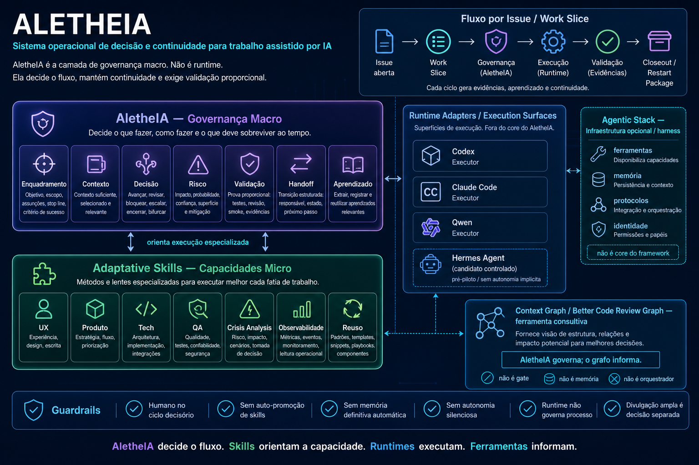

# AletheIA

**AletheIA** is an operating framework for AI-assisted work: a portable layer that turns model or agent output into bounded, reviewable, validated action.



AletheIA exists because capable agents still need an operating system around the work: scope, context, governance, validation, handoff and learning. The framework is not trying to replace human judgment or project-local rules. It makes the decision path visible enough that people can trust, review and restart the work.

In short:

```text
model or agent output -> AletheIA -> governed action
```

---

## What AletheIA is

AletheIA is:

- **provider-agnostic** — it can be applied across models, agents and local runtimes
- **work-slice oriented** — every meaningful task has a bounded goal, scope, risk and validation path
- **governance-first** — risky or unclear work can slow down, escalate, require review or stop
- **restartable** — continuity is carried through handoffs and restart packages, not fragile transcript memory
- **evidence-seeking** — proof is part of closure, not a decorative afterthought
- **learning-oriented** — repeated friction and validation failures can become durable, reviewable improvements

## What AletheIA is not

AletheIA is not:

- a chatbot
- a single-runtime wrapper
- a hidden autonomous router
- a replacement for human accountability
- a substitute for project-local operating rules
- a claim that every future tooling or enterprise track is already complete

---

## How the operating loop works

AletheIA moves work from a loose prompt-output pattern into an explicit operating loop:

```text
signal -> framing -> context -> governance -> bounded execution -> validation -> learning / restartable handoff
```

That means the framework asks practical questions before treating output as executable:

1. **What is the work slice?**  
   Define the goal, scope, risk, assumptions and stop line.
2. **What context is enough?**  
   Load the context needed for the slice without turning every transcript into mandatory state.
3. **What decision is being made?**  
   Allow, slow down, escalate, block, hand off or restart.
4. **What execution surface is appropriate?**  
   Keep runtime choice explicit instead of pretending every agent has the same trust boundary.
5. **What proof closes the slice?**  
   Use proportional validation: tests, review, smoke checks, artifacts or documented evidence.
6. **What survives the boundary?**  
   Preserve durable decisions, restart packages, handoffs and learnings.

---

## Current status

AletheIA is at **1.0.0**.

What 1.0 means:

- the Alpha 1–7 baseline is complete enough for public reuse
- the core vocabulary and adoption path are stable enough to teach and apply
- new work now belongs to **1.x evolution tracks**, not unfinished baseline buildup

What 1.0 does **not** mean:

- enterprise-ready by default
- fully automated orchestration
- completed domain governance packs
- active delivery tooling implementation
- universal runtime enforcement

### Recent evolution

The active post-1.0 work has moved in three important directions:

- **1.1 constrained adoption / trust-boundary hardening**  
  Guidance for safer adoption in local, regulated or high-context environments.
- **1.2 resource-aware operations**  
  Advisory observability for context size, restart cost, handoff weight, retry waste, runtime fit and human review effort.
- **clean restart and project-local constitution patterns**  
  Stronger restart packages, local governing-context prompts and explicit fresh-thread signaling without making any one runtime command part of the portable core.

For release framing, see:

- `CHANGELOG.md`
- `docs/release-1.0-readiness.md`
- `docs/roadmap-alpha.md`
- `docs/enterprise-readiness-roadmap.md`
- `docs/resource-aware-operations-roadmap.md`

---

## Core concepts

AletheIA keeps a stable vocabulary so the framework is not redefined by one tracker, one chat surface or one runtime.

The most important concepts are:

- **Work Slice** — the bounded unit of operational work
- **Work Item** — the external coordination unit a slice may point to
- **Context Pack** — the explicit context selected for a slice
- **Decision Record** — the reviewable reason for continuing, slowing down, escalating or stopping
- **Execution Surface** — the local runtime where work happens
- **Runtime Adapter** — the runtime-local mapping that preserves framework meaning
- **Handoff** — the transition artifact for a meaningful boundary
- **Restart Package** — the compact continuity artifact used after a boundary
- **Learning Record** — a reviewable improvement extracted from real work

Canonical definitions start here:

- `docs/canonical-vocabulary.md`
- `docs/canonical-definitions.md`
- `docs/work-slice-pattern.md`
- `docs/runtime-adapter-contract.md`

---

## What is in this repository

The repository is organized around four practical blocks:

1. **Framework core**
   - `engine/`, schemas, governance, token discipline, quality, learnings, examples and tests
2. **Starter pack**
   - reusable guides, templates, checklists and playbooks for applying AletheIA in a project
3. **Pilot and adoption materials**
   - self-application, Crisis Monitor grounding, constrained adoption, project extension and pilot conversion
4. **1.x evolution tracks**
   - trust-boundary hardening, resource-aware operations, runtime-adapter guidance and future domain governance work

Crisis Monitor remains an important pilot source, but its product-specific runtime, UI, assistant behavior and project-management rules are not the portable AletheIA core.

---

## Where to start

### Fastest understanding path

1. `docs/getting-started.md`
2. `docs/00-overview.md`
3. `docs/governance.md`
4. `docs/token-policy.md`
5. `docs/canonical-vocabulary.md`

### Apply AletheIA to a project

1. `starter-pack/README.md`
2. `starter-pack/guides/daily-operations.md`
3. `docs/apply-to-existing-project.md`
4. `docs/project-extension-pattern.md`

### Work with handoffs and restart

1. `docs/agent-handoffs.md`
2. `docs/slice-finalization-and-restart.md`
3. `starter-pack/guides/clean-restart-command-adapters.md`
4. `starter-pack/templates/restart-bootstrap-prompt-template.md`

### Work with runtime fit and resource-aware operations

1. `docs/runtime-adapter-contract.md`
2. `docs/agent-runtime-decision-guide.md`
3. `docs/context-resource-telemetry-spec.md`
4. `docs/slice-telemetry-model.md`
5. `docs/waste-heuristics.md`

### Inspect examples first

1. `examples/hello-world/`
2. `examples/handoffs/compact-reviewable-handoff.md`
3. `examples/work-slices/standard-slice/README.md`
4. `examples/resource-aware-operations/`

---

## Design principles

1. Clarity over speed
2. Control over automation
3. Consistency over convenience
4. Reuse before duplication
5. Validation before closure
6. Learnings must stay reviewable
7. Project-local rules stay project-local

---

## Quick check

After cloning, run the lightweight governance check:

```bash
bash scripts/check-governance.sh
```

If you are changing the TypeScript engine or examples, run the package tests as well:

```bash
pnpm install
pnpm test
```

---

## License

AletheIA is released under the Apache License 2.0. See `LICENSE`.

---

## See also

- `docs/launch-kit.md`
- `CHANGELOG.md`
- `CONTRIBUTING.md`
- `SECURITY.md`
