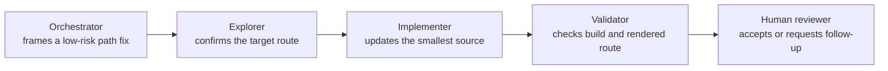

Three ideas are often mixed together in AI-assisted work. AletheIA keeps them deliberately separate:

<Columns cols={3}>
  <Column>
    <Panel title="Agent role">
      A portable responsibility in governed work: who is framing, exploring, implementing, reviewing, or validating.
    </Panel>
  </Column>
  <Column>
    <Panel title="Runtime">
      The environment that executes tools and has its own local mechanics and permissions: Codex, Claude Code, or Qwen.
    </Panel>
  </Column>
  <Column>
    <Panel title="Adaptive Skill">
      A reusable specialist method that improves how work is executed within a role, such as planning, testing, or debugging.
    </Panel>
  </Column>
</Columns>

:::note[Simple rule]
AletheIA governs the work. A role carries a responsibility. A runtime executes. A skill provides a method.
:::

## Why the distinction matters

When these concepts collapse into one label, teams lose clarity about ownership:

| If they are mixed | What becomes unclear | AletheIA response |
|---|---|---|
| “Codex is the reviewer” | Is the responsibility portable, or tied to one product? | Record `reviewer` as the role and Codex as the runtime. |
| “Use the testing agent” | Is testing a role, a method, or an approval? | Keep the role and chosen skill explicit. |
| “The PM agent approved it” | Was there a human decision, a persona, or a runtime output? | Treat personas as illustrative unless a contract defines a real role. |
| “The runtime has guardrails” | Which boundary is enforced versus advisory? | Identify the actual local permission or human gate. |

## Canonical portable roles

<CardGroup cols={2}>
  <Card title="Orchestrator" href="/reference/agent-role-orchestrator/" icon="waypoints">
    Frames the Work Slice, integrates results, and decides the next healthiest boundary.
  </Card>
  <Card title="Explorer" href="/reference/agent-role-explorer/" icon="search">
    Reduces discoverable unknowns before implementation or judgment hardens around weak context.
  </Card>
  <Card title="Implementer" href="/reference/agent-role-implementer/" icon="wrench">
    Executes a decision-closed, bounded change and reports what was actually done.
  </Card>
  <Card title="Reviewer" href="/reference/agent-role-reviewer/" icon="messages-square">
    Challenges semantic risk, contract drift, assumptions, and insufficient proof.
  </Card>
  <Card title="Validator" href="/reference/agent-role-validator/" icon="badge-check">
    Confirms closure evidence or explains the remaining proof gap.
  </Card>
</CardGroup>

Not every Work Slice needs all five roles. Use the smallest set that makes the boundary, decision, and proof clear.

## Example: one documentation correction



The same example can run in different environments:

| Layer | One possible choice | What remains stable |
|---|---|---|
| Role | `implementer` | Bounded execution responsibility |
| Runtime | Codex | Local tools and session mechanics |
| Skill | `testing` | Verification method, when it materially shapes the work |
| Governance | AletheIA Work Slice | Scope, evidence, stop line, and closure decision |

## Runtime adapters

<CardGroup cols={3}>
  <Card title="Codex adapter" href="/reference/runtime-adapter-codex/" icon="terminal-square">
    Tool-based execution surface; the main session commonly holds the Orchestrator boundary.
  </Card>
  <Card title="Claude Code adapter" href="/reference/runtime-adapter-claude-code/" icon="braces">
    Local agent files and richer runtime metadata may help, while portable role meaning remains unchanged.
  </Card>
  <Card title="Qwen adapter" href="/reference/runtime-adapter-qwen/" icon="cpu">
    Lighter or custom environments can preserve explicit roles through prompts, wrappers, and handoffs.
  </Card>
</CardGroup>

:::warning[Runtime boundary]
A runtime adapter does not change access rights, make local configuration a framework contract, or prove a role was correctly performed. Validate the actual output and permissions in the real environment.
:::

## Where Adaptive Skills fits

Adaptive Skills provides portable methods that may support a role—for example, planning, debugging, testing, research, or documentation. A skill is selected because its method is useful for the slice, not because it grants authority.

```text
Work Slice governance (AletheIA)
  └── active role (portable responsibility)
        └── selected skill (reusable method, if useful)
              └── runtime adapter (local execution mechanics)
```

The skill should appear in a handoff or record only when it materially influenced the method, validation, or continuation path.

## Non-goals

This model does not:

- introduce more canonical roles;
- turn presentation personas into available agents;
- require every runtime to have native subagents;
- turn the role catalog into an automatic router;
- change Adaptive Skills behavior, capability metadata, or governance;
- authorize a runtime, tool, or security-sensitive action.

## Next steps

- [Browse the full agent role catalog](/reference/agent-role-catalog/)
- [Read the ecosystem layer map](/concepts/ecosystem-layers/)
- [Choose an execution pattern](/concepts/execution-pattern-governance/)
- [Review security and trust boundaries](/security/README/)
