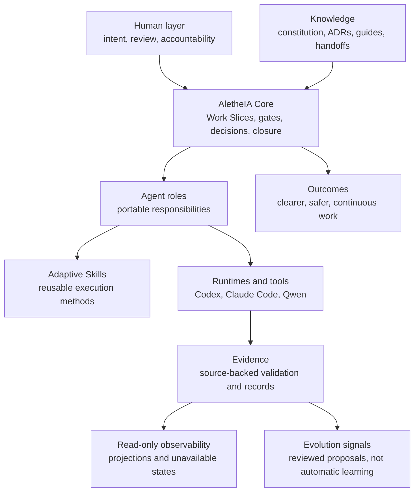

AletheIA is the **governance center** of an AI-assisted work ecosystem. It helps people frame work, set boundaries, select proportional review, preserve evidence, and decide how work should continue.

It does not replace the people, runtimes, skills, project knowledge, or tools around it.

<Badge variant="accent">Guided map</Badge> <Badge>Provider-agnostic</Badge> <Badge variant="success">Source-backed maturity</Badge>

:::note[How to use this page]
This is an orientation map. It explains ownership and relationships; it is not a runtime architecture, implementation checklist, or claim that every layer is automated today.
:::

## The ecosystem at a glance

## The layers

<CardGroup cols={2}>
  <Card title="Human layer" href="#human-layer" icon="users-round">
    People define intent, accept consequences, set cognitive needs, and remain accountable for meaningful decisions.
  </Card>
  <Card title="AletheIA Core" href="#aletheia-core" icon="landmark">
    The operating overlay that governs Work Slices, decisions, review gates, evidence expectations, and closure.
  </Card>
  <Card title="Agent layer" href="#agent-layer" icon="bot">
    Portable responsibilities such as Orchestrator and Validator; roles are not runtimes or product personas.
  </Card>
  <Card title="Adaptive Skills" href="#adaptive-skills" icon="blocks">
    Reusable methods that help a role execute work consistently without owning governance.
  </Card>
  <Card title="Knowledge and continuity" href="#knowledge-and-continuity" icon="book-open-check">
    Constitution, decisions, guides, handoffs, and Restart Packages that make context reviewable and reusable.
  </Card>
  <Card title="Runtime and safety" href="#runtime-and-safety" icon="shield-check">
    The environments and tools that execute work under local permissions and explicit human review boundaries.
  </Card>
  <Card title="Observability" href="#observability" icon="chart-no-axes-combined">
    Read-only, source-backed projections of records and explicitly unavailable states—not a control system.
  </Card>
  <Card title="Evolution signals and outcomes" href="#evolution-and-outcomes" icon="arrow-up-right">
    Reviewed observations may inform proposals; outcomes remain evidence-bound rather than guaranteed.
  </Card>
</CardGroup>

## Human layer

**Purpose:** keep intent, judgment, context, and accountability explicit.

People decide the goal, risk tolerance, acceptable scope, and whether work may proceed. AletheIA can make these choices easier to inspect; it cannot take responsibility for them.

**Today:** human review gates, explanation-depth choices, and bounded Work Slices are supported as guidance and contracts.

**Boundary:** AletheIA does not score people, infer expertise automatically, or convert a human review into a formality.

## AletheIA Core

**Purpose:** govern how AI-assisted work moves from a signal or intent to a safe closeout, handoff, or restart.

The core frames a [Work Slice](/concepts/work-slice-pattern/), selects the minimum necessary context, makes gates explicit, and asks for proof proportionate to the consequence.

**Today:** the 1.x operating baseline supports governance, decisions, evidence expectations, closure, and read-only operational projection.

**Boundary:** the core is not an autonomous router, specialist-agent bundle, runtime kernel, or permission system.

## Agent layer

**Purpose:** assign a portable responsibility to the current boundary of work.

The five canonical roles are **Orchestrator**, **Explorer**, **Implementer**, **Reviewer**, and **Validator**. They describe *what responsibility is active*, not which tool, model, or job title is being used.

**Today:** the canonical role catalog and runtime adapter guidance are documented and validated.

**Boundary:** presentation personas such as PM, Product Design, Security, or Documentation agent are illustrative specializations. They are not additional canonical roles unless an accepted source establishes them.

Read [Roles, runtimes, and Adaptive Skills](/concepts/agent-runtime-skill-model/) before creating or naming a local agent.

## Adaptive Skills

**Purpose:** provide reusable, portable methods inside an active role.

Adaptive Skills is a separate project. It owns skill definitions, capability metadata, compatibility declarations, and its own governed evolution practices. AletheIA owns the Work Slice and its governance.

**Today:** AletheIA can use Adaptive Skills as advisory execution support. The two projects remain independently usable.

**Boundary:** selecting a skill does not approve scope, authorize a tool, or make a runtime decision.

## Knowledge and continuity

**Purpose:** keep durable context separate from temporary chat or runtime memory.

This layer includes a project constitution, ADRs, source-backed guides, Decision Records, Handoff Records, and Restart Packages. It is how a new person or runtime can understand the work without replaying an entire conversation.

**Today:** the source-controlled documentation, decision, handoff, and restart patterns are part of the operating baseline.

**Boundary:** durable knowledge is not automatic memory writeback or self-promoting learning. Any proposed evolution remains reviewable.

## Runtime and safety

**Purpose:** execute tools under the permissions, limitations, and policies of a real environment.

Codex, Claude Code, and Qwen are runtime adapters. They can host the same portable role with different local mechanics. Local permissions stay local; AletheIA does not grant access, install a sandbox, or enforce security controls merely by documenting a gate.

**Today:** runtime adapters, human-review criteria, and domain-governance guidance are documented. The security packs are advisory and must be applied to a real Work Slice before they count as usage evidence.

**Boundary:** no Runtime 2.0 kernel, automatic enforcement, scanner, collector, or policy engine is active.

## Observability

**Purpose:** make source-backed records easier to inspect without turning visibility into execution authority.

Resource Observatory and Work Observatory surfaces project known records and preserve neutral `unavailable` states when a source does not exist.

**Today:** read-only source-backed projections and selected evidence examples are delivered.

**Boundary:** no automatic collectors, inferred metrics, people scoring, autonomous decisions, comparative metrics, or dashboard expansion is implied.

## Evolution and outcomes

**Purpose:** turn reviewed observations into possible improvements while keeping claims proportional to evidence.

An observation can lead to a proposal, a bounded experiment, a human review, and an accepted change. It does not become a self-modifying loop.

**Today:** reviews, pilots, and source-backed evolution records exist.

**Boundary:** clarity, continuity, and value are intended outcomes. They are not guaranteed performance metrics or claims of autonomous learning.

## Next steps

- [Learn the role, runtime, and skill model](/concepts/agent-runtime-skill-model/)
- [Follow a first Work Slice](/guides/getting-started/)
- [Understand AletheIA and Adaptive Skills](/contracts/capability-routing-reconciliation/)
- [Check the current system state](https://github.com/nevitonsantana/AletheIA/blob/main/SYSTEM_STATE.md)
