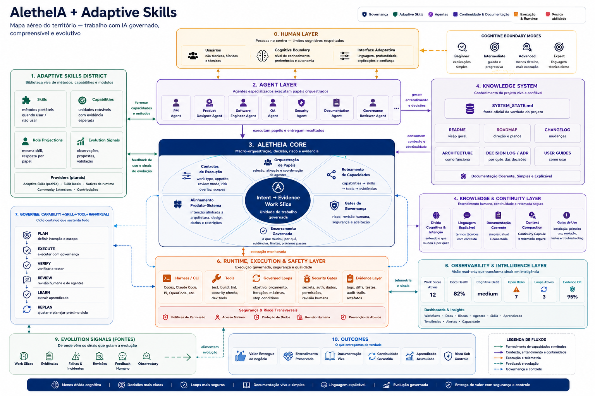

# AletheIA + Adaptive Skills — Ecosystem Territory Map

## Purpose

This image is a **north-star map** for explaining the territory being built across AletheIA, Adaptive Skills, runtimes, project knowledge, continuity, observability and human decision-making.

It complements the broader [agentic ecosystem map](ecosystem-map.md). It is an orientation surface, not a normative architecture contract, implementation inventory or lifecycle.

## How to read it

- **AletheIA Core** owns macro governance: Work Slice framing, pattern selection, gates, decisions, evidence expectations and closure.
- **Adaptive Skills** supplies portable methods, capability metadata, compatibility declarations and evolution signals.
- **Agent roles** are projected responsibilities. The map does not claim that every illustrated agent is implemented or autonomous.
- **Runtime, execution and safety** represents harnesses, tools and evidence-producing execution surfaces. It does not move runtime authority into AletheIA.
- **Knowledge and continuity** represents project documents, decisions, context loading and safe resumption.
- **Observability and intelligence** is an umbrella territory. Resource Observatory, Observation Governance and the planned Work Observatory remain logically distinct within it.
- **Human layers and cognitive modes** express the intended communication and review posture; they do not bypass risk, permission or human-review requirements.

The numbered regions are compositional labels. They are not an execution order or a new mandatory lifecycle.

## Authority and truth

The diagram is not a source of operational truth. Current contracts, accepted decisions, source records and evidence remain authoritative.

`SYSTEM_STATE` is shown as a future first-load registry: a compact index of what is currently implemented, planned, deprecated, stale or risky in one repository. It must not replace canonical contracts, ADRs, execution records, evidence or the integrated backlog. AletheIA and Adaptive Skills will each maintain their own small state registry when the corresponding backlog slice is implemented.

## Illustrative content

Dashboard values, health percentages, active-loop counts and similar numbers in the image are illustrative only. They are not current AletheIA telemetry and must not be copied into the Resource Observatory or Mission Control without source-backed records.

The map also shows intended outcomes such as preserved understanding, living documentation and accumulated learning. Those are product directions, not claims that measurement or automation already exists.

## Backlog relationship

The [integrated evolution backlog](../roadmaps/evolution-backlog-aletheia-adaptive-skills.md) remains the implementation and dependency map. It records:

- the original P0–P9 evolution packs;
- P10 Work Observatory;
- P11 Cognitive Documentation & Continuity;
- the incremental slices required to test these ideas without creating parallel authorities or premature infrastructure.

Before implementing any pack, reopen its complete source package and reconcile it with the current repositories.

## Non-goals

This map does not introduce:

- a new source of truth;
- a second AletheIA architecture;
- a fixed multi-agent topology;
- a new runtime or orchestration engine;
- a dashboard data contract;
- a mandatory documentation lifecycle;
- an automatic learning or replanning loop.
