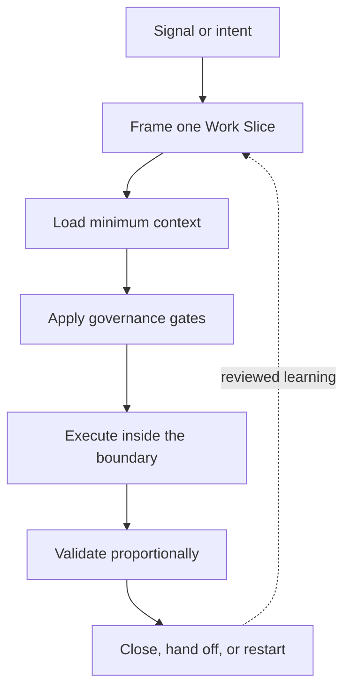

AletheIA is a portable operating overlay for AI-assisted work. It turns model or agent output into bounded, reviewable, validated action without replacing human judgment, project rules, or the runtime that executes the work.

<Badge variant="success">Version 1.0</Badge> <Badge>Provider-agnostic</Badge> <Badge variant="accent">Human-governed</Badge>

## Choose your path

<CardGroup cols={3}>
  <Card title="I am new to AletheIA" href="/AletheIA/getting-started/overview/" icon="compass">
    Understand the problem AletheIA solves, its benefits, boundaries, and where it fits in AI-assisted work.
  </Card>
  <Card title="I want to use it" href="/AletheIA/guides/getting-started/" icon="rocket">
    Run a first low-risk Work Slice and see the operating loop in practice before exploring the architecture.
  </Card>
  <Card title="I want to go deeper" href="/AletheIA/concepts/architecture/" icon="layers">
    Explore governance, contracts, agent roles, runtimes, security, observability, evidence, and evolution.
  </Card>
</CardGroup>

## Try AletheIA in two minutes

Start with a disposable or already version-controlled project and one reversible task. Follow the [two-minute first test](https://github.com/nevitonsantana/AletheIA#try-it-in-two-minutes) to materialize the overlay, frame one Work Slice, observe the decision and validation path, and report what helped or caused friction.

This is a low-risk adoption test, not an autonomous runtime setup. AletheIA governs the flow; runtimes execute; tools inform. Adaptive Skills are a separate, complementary micro-capability layer and are not required for this first test.

## The problem it solves

AI-assisted work can move quickly while still losing scope, reasoning, proof, or continuity. AletheIA makes those boundaries visible before action and preserves the evidence needed to review or restart the work later.

<Columns cols={2}>
  <Column>
    <Panel title="Bound the work">
      Frame one Work Slice with a goal, scope, risk, assumptions, and a stop line instead of letting a session expand silently.
    </Panel>
  </Column>
  <Column>
    <Panel title="Make decisions traceable">
      Record why work may continue, slow down, require review, split, stop, or move to another operator.
    </Panel>
  </Column>
  <Column>
    <Panel title="Require proportional proof">
      Match validation to consequence through tests, review, smoke checks, evidence, or an explicit unavailable state.
    </Panel>
  </Column>
  <Column>
    <Panel title="Preserve continuity">
      Carry decisions, remaining work, risks, and the next safe action through handoffs and Restart Packages.
    </Panel>
  </Column>
</Columns>

## How the operating loop works

<Steps>
  <Step title="Frame">
    Define the intended outcome, what is in and out of scope, risk, assumptions, and when the operator must pause.
  </Step>
  <Step title="Decide">
    Select enough context, the required review gates, and an appropriate execution surface before tools act.
  </Step>
  <Step title="Execute">
    Work only inside the declared slice. Roles and Adaptive Skills may support the task, but they do not replace governance.
  </Step>
  <Step title="Validate and continue">
    Produce reviewable proof, record the decision, and leave a clean closeout, handoff, or Restart Package.
  </Step>
</Steps>

## Practical benefits

| Without an explicit operating loop | With AletheIA |
|---|---|
| Scope can drift during a long session | The Work Slice defines a visible boundary and stop line |
| Decisions disappear inside transcripts | Durable records preserve reasoning and consequences |
| Validation depends on whether an answer looks plausible | Closure requires evidence proportional to risk |
| The next person or agent reconstructs context | Handoffs and Restart Packages preserve continuity |
| Runtime behavior and governance become mixed | AletheIA governs; runtimes execute; tools inform |

## What AletheIA is not

:::note[Governance aid, not autonomous authority]
AletheIA is not a chatbot, autonomous router, agent runtime, specialist-agent bundle, security sandbox, or replacement for accountable human decisions. It does not grant permissions or guarantee outcomes.
:::

## Explore the system

<CardGroup cols={2}>
  <Card title="Install AletheIA" href="/AletheIA/getting-started/installation-guide/" icon="download">
    Materialize the operating overlay and verify its project entry points.
  </Card>
  <Card title="Core operating path" href="/AletheIA/guides/core-operating-path/" icon="workflow">
    Follow the minimum path from signal to validated closure.
  </Card>
  <Card title="AletheIA and Adaptive Skills" href="/AletheIA/contracts/capability-routing-reconciliation/" icon="blocks">
    See how macro-governance and portable execution capabilities remain separate and complementary.
  </Card>
  <Card title="Frequently asked questions" href="/AletheIA/getting-started/faq/" icon="circle-help">
    Resolve common questions about adoption, installation, security, teams, and runtimes.
  </Card>
</CardGroup>

## Current maturity

AletheIA has a stable **1.0 operating baseline** and continues through bounded 1.x evolution. Visual Operations, observation governance, context-surface governance, execution-pattern guidance, security domain packs, and continuity patterns have delivered documentation or pilot baselines.

Automatic collectors, routing engines, autonomous learning, new dashboards, comparative metrics, people scoring, and Runtime 2.0 implementation remain blocked or evidence-gated. Read the [current system state on GitHub](https://github.com/nevitonsantana/AletheIA/blob/main/SYSTEM_STATE.md) before making maturity claims.

## Creator

AletheIA was created and is maintained by **Neviton Santana**, a Staff/Principal Designer working across product design, complex systems, artificial intelligence, and governed AI-assisted work.

<CardGroup cols={3}>
  <Card title="About the creator" href="/AletheIA/about/" icon="user-round">
    Learn about the perspective and principles behind AletheIA.
  </Card>
  <Card title="GitHub" href="https://github.com/nevitonsantana" icon="github">
    Follow AletheIA, Adaptive Skills, releases, and ongoing development.
  </Card>
  <Card title="LinkedIn" href="https://www.linkedin.com/in/neviton" icon="linkedin">
    Connect with Neviton and follow his work on design, AI, governance, and agentic systems.
  </Card>
</CardGroup>

## Next steps

- New reader: [What is AletheIA?](https://nevitonsantana.github.io/AletheIA/getting-started/overview/)
- Ready to try it: [Getting started guide](https://nevitonsantana.github.io/AletheIA/guides/getting-started/)
- Adopting in a project: [Installation guide](https://nevitonsantana.github.io/AletheIA/getting-started/installation-guide/)
- Maintaining the framework: [Architecture Decision Records](https://nevitonsantana.github.io/AletheIA/adr/README/)
