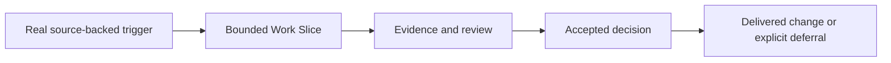

The roadmap separates what AletheIA has delivered from what is merely planned, deferred, or waiting for stronger evidence. The integrated backlog remains the authoritative dependency map.

## Delivered

<CardGroup cols={2}>
  <Card title="Operating baseline" href="/concepts/overview/" icon="layers">
    Work Slices, governance gates, decisions, validation, closure, continuity, and portable boundaries.
  </Card>
  <Card title="Adoption and documentation" href="/guides/getting-started/" icon="book-open-check">
    APM/manual installation paths, first-use guidance, public docs validation, and manual publication evidence.
  </Card>
  <Card title="Security guidance" href="/concepts/security-and-trust/" icon="shield-check">
    S28/S29 advisory packs plus real-slice usage evidence and limits on what that evidence proves.
  </Card>
  <Card title="Read-only observation" href="/concepts/observability-and-evidence/" icon="eye">
    Resource and Work Observatory concepts with source references, privacy boundaries, and neutral unavailable states.
  </Card>
</CardGroup>

## Active

There is currently **no active backlog implementation slice**. New work should begin only when a real source-backed trigger exists and its scope fits the existing boundaries.

## Deferred and evidence-gated

| Candidate | Why it is not active |
|---|---|
| Comparative Work Observatory metrics | The current records are heterogeneous; a stable reviewed comparison group is required first. |
| Runtime 2.0 implementation | Requires a later explicit boundary decision. |
| Automatic collectors, dashboards, and policy engines | Need a separate decision and source-backed evidence; current observability is read-only. |
| Automatic learning classification and memory writeback | Remain blocked to preserve reviewable, human-governed evolution. |
| Adaptive Skills mutation | AletheIA cannot authorize or mutate the separate skill system. |
| Automatic publishing on merge | Publication remains manual until a separate publishing-governance decision changes that posture. |

## How change becomes real

An external pack, a presentation diagram, an idea, or an example can inform a future review. None becomes an implementation commitment without this path.

## Canonical planning sources

- [Integrated evolution backlog](/roadmaps/evolution-backlog-aletheia-adaptive-skills/)
- [Evolution plan](/roadmaps/evolution-plan/)
- [1.0 baseline and 1.x roadmap](/roadmaps/roadmap-alpha/)
- [Technical system state](https://github.com/nevitonsantana/AletheIA/blob/main/SYSTEM_STATE.md)

## Next steps

- [See current supported posture](/updates/current-state/)
- [Explore evidence and case reports](/pilots/cases-and-evidence/)
- [Read the technical roadmap index](/roadmaps/README/)
