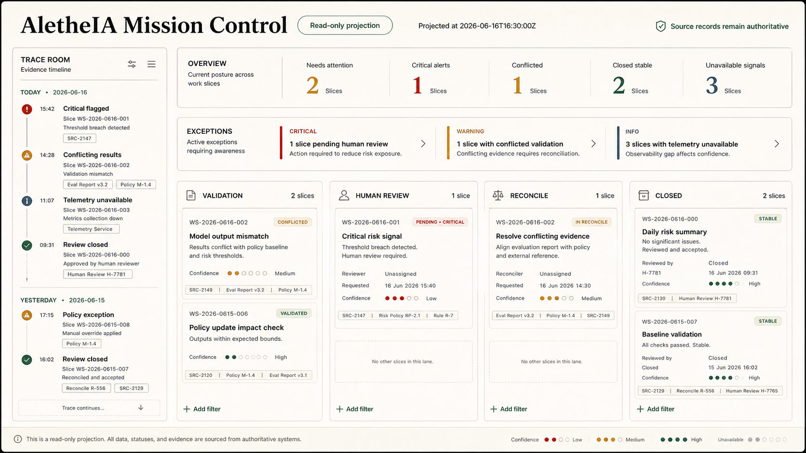

# Visual Operations Cockpit Refined Visual Mock

## Purpose

Record the first single-screen refined visual mock for AletheIA Mission Control.

This is a static design artifact. It is not a runnable UI, Figma file, frontend app, dashboard,
backend, collector, runtime, schema, policy engine, or Adaptive Skills integration.

## Selected visual direction

**Trace Room + Evidence Desk**

This refined mock narrows the previous three-option exploration into one screen direction: a
trace-led, evidence-first cockpit that keeps source confidence visible while preserving a calm,
editorial operating surface.

## What changed from the exploration board

| Area | Refinement |
|---|---|
| Direction | Collapsed the exploration board into one selected screen direction instead of three alternatives. |
| Trace rail | Made the left evidence timeline a first-class region rather than an optional variation. |
| Overview | Kept compact attention metrics above the board so the first read is operational. |
| Exception strip | Preserved critical/warning/info hierarchy before lanes. |
| Board | Kept lanes as read-only posture groups, without drag/drop affordances. |
| Cards | Reinforced source rails, confidence chips, and source refs as visible card anatomy. |

## Design rationale

The refined mock should communicate three things at a glance:

1. **What needs attention first** — pending review and conflicted validation lead the scan.
2. **Why the cockpit says that** — trace/source rails remain visible at rest.
3. **What the cockpit cannot claim** — unavailable signals stay neutral and source records remain
   authoritative.

The screen avoids generic dashboard tropes: no vanity charts, no neon command-center treatment, no
project-management drag/drop language, and no visual implication that the board can mutate truth.

## Required semantics preserved

| Semantic rule | Visual treatment in the mock |
|---|---|
| `unavailable` is not error | Neutral unavailable chips and copy. |
| Alerts are review prompts | Exception strip uses review language, not approve/reject commands. |
| Lanes are derived posture | Lane groups are read-only sections, not workflow controls. |
| Source records remain authoritative | Header boundary and visible source refs keep provenance present. |
| Conflicts require review | Conflicted validation gets a stronger treatment than normal warning. |
| Critical review leads scan | Pending human review uses the highest-attention treatment. |

## Strategic reading

Destination: **Camada 1 — Existência** and **Camada 3 — Sustentação**.

| Bucket | Reading |
|---|---|
| Facts | The visual layer projects existing records; it does not govern or execute. |
| Interpretations | Mission Control exists to make the relationship between work, evidence, review, and source confidence legible. |
| Hypotheses | A trace-led cockpit will help reviewers trust the surface faster than a card-only board. |
| Implications | Future prototypes should protect trace/source visibility before adding interaction or data plumbing. |

## Relationship to previous artifacts

This refined mock follows:

- [Cockpit visual mock direction](cockpit-visual-mock-direction.md)
- [Cockpit light wireframe spec](cockpit-light-wireframe-spec.md)
- [Cockpit static board composition](cockpit-static-board-composition.md)
- [Cockpit card state examples](cockpit-card-state-examples.md)

It should be treated as the current visual target for any future static prototype with mock data.

## Boundaries

Do not use this mock to justify:

- backend or persistence;
- GitHub collector/importer;
- runtime or event bus;
- schema changes;
- policy engine changes;
- Adaptive Skills integration;
- drag/drop board behavior;
- source-free inference of review, readiness, telemetry, or closure.

## Review questions

1. Is the trace rail useful enough to become a required first prototype region?
2. Does the first read prioritize pending review and conflicted sources correctly?
3. Does the screen still feel calm and audit-ready rather than alarmist?
4. Are neutral gaps like `unavailable` visually distinct from failed/critical states?
5. Are source refs visible enough to invite verification without overwhelming scan?
6. Is this direction strong enough to become the visual target for a static frontend prototype?

## Next step

If accepted, the next bounded slice can be a static frontend prototype with mock data only, using this
refined mock as the visual target and preserving read-only semantics.
