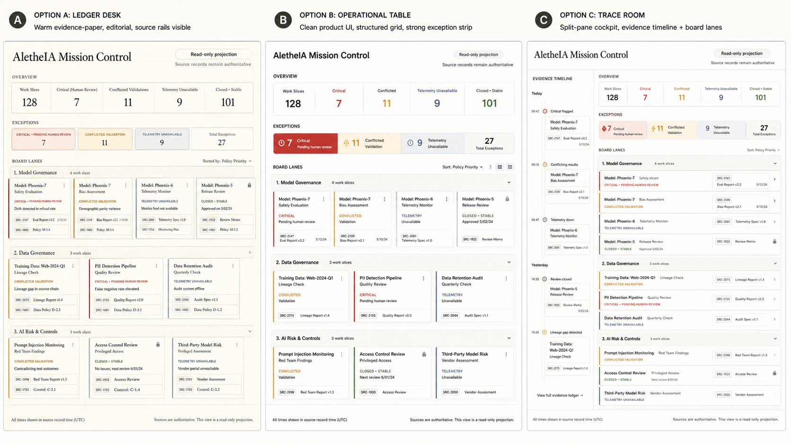

# Visual Operations Cockpit Visual Mock Direction

## Purpose

Record the first versioned visual mock direction for AletheIA Mission Control.

This is a static design artifact. It is not a runnable UI, Figma file, frontend app, dashboard,
backend, collector, runtime, schema, policy engine, or Adaptive Skills integration.

## Selected direction

**Trace Room + Evidence Desk**

Use the operational split/trace strength from option C and the editorial restraint from option A.
The cockpit should feel like an auditable evidence desk: calm, source-first, and serious enough for
human review, but visually sharp enough that pending review and source conflicts are impossible to
miss.

The image above is the initial versioned exploration board. It contains three options; the selected
path is **C + A**, not a literal commitment to every detail in the image.

## Design rationale

| Decision | Rationale |
|---|---|
| Use a trace/timeline rail | The trace rail makes source sequence and review context visible without forcing the reviewer to open every raw record first. |
| Keep an evidence-desk tone | AletheIA needs trust and legibility more than a dramatic command-center aesthetic. |
| Preserve source rails on cards | Provenance must be part of the visible card anatomy, not hidden behind hover-only detail. |
| Prioritize exception strip before lanes | The first read should be “what needs attention?” rather than “how many cards exist?” |
| Keep unavailable states neutral | `unavailable` means the source did not provide authority; it is not failure. |
| Avoid drag/drop board language | Lanes are derived presentation posture, not a lifecycle or state mutation control. |

## Strategic reading

Destination: **Camada 1 — Existência** and **Camada 3 — Sustentação**.

| Bucket | Reading |
|---|---|
| Facts | Existing docs define Mission Control as a read-only projection over Work Slice, evidence, readiness, review, trace, and telemetry records. |
| Interpretations | The visual surface exists to reduce ambiguity between execution, evidence, and decision, not to replace governance records. |
| Hypotheses | A source-led visual treatment will make the cockpit more trustworthy for technical-adjacent reviewers than a generic dashboard aesthetic. |
| Implications | The next artifact should preserve evidence/source visibility as a primary design element and avoid visual patterns that imply automation or authority. |

## Relationship to the wireframe spec

This mock direction concretizes the
[light wireframe spec](cockpit-light-wireframe-spec.md):

- **Header and authority boundary:** visible “read-only projection” and source-authority notice.
- **Overview strip:** attention metrics appear before normal board content.
- **Exception strip:** critical/pending review and conflicted sources are surfaced before stable cards.
- **Trace rail:** a left-side evidence sequence supports the “Trace Room” direction.
- **Board lanes:** lanes remain visual grouping, not drag/drop project state.
- **Cards:** source rails and confidence chips keep provenance visible.

## Required boundaries

The visual mock must preserve these boundaries:

- `unavailable` is not an error state;
- alerts are prompts for review, not enforcement decisions;
- lanes are derived presentation posture, not a mandatory lifecycle;
- source records remain authoritative;
- telemetry is optional and provenance-labeled;
- skills and runtime signals do not govern readiness or closure;
- restricted content stays metadata-first.

## What this should not become yet

Do not use this artifact to justify:

- UI implementation;
- frontend app scaffolding;
- backend, persistence, or database work;
- GitHub collector/importer work;
- runtime or event bus work;
- schema changes;
- policy engine changes;
- Adaptive Skills integration.

Those require separate Work Slices after this mock direction is reviewed.

## Review questions

Use these questions before moving to the next visual artifact:

1. Does the trace rail help explain why the board says what it says?
2. Does the visual language feel like evidence and review rather than project management?
3. Are critical review, conflicted sources, and unavailable telemetry visibly different?
4. Does the selected direction avoid generic dashboard tropes?
5. Is source visibility strong enough without overwhelming scan?
6. Can a designer, PM, or governance reviewer understand the first read without code context?

## Next step

If accepted, the next bounded visual slice can be either:

1. a refined single-screen mock focused only on the selected **Trace Room + Evidence Desk** direction;
   or
2. a static frontend prototype with mock data only, still read-only and disconnected from backend or
   collectors.
